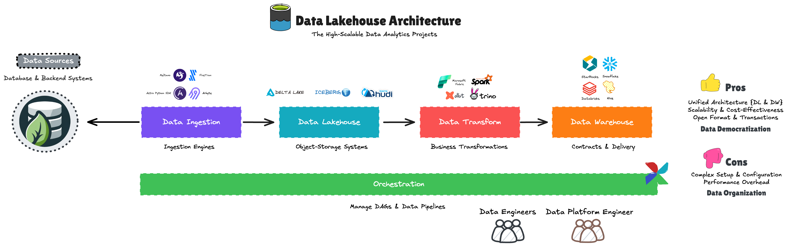
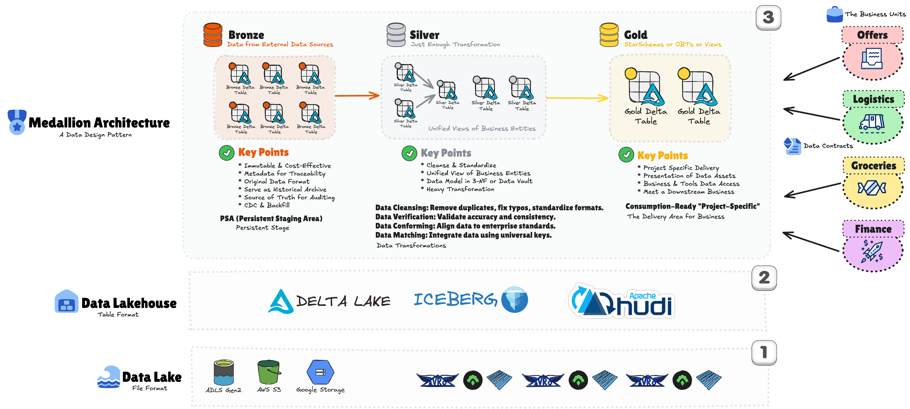
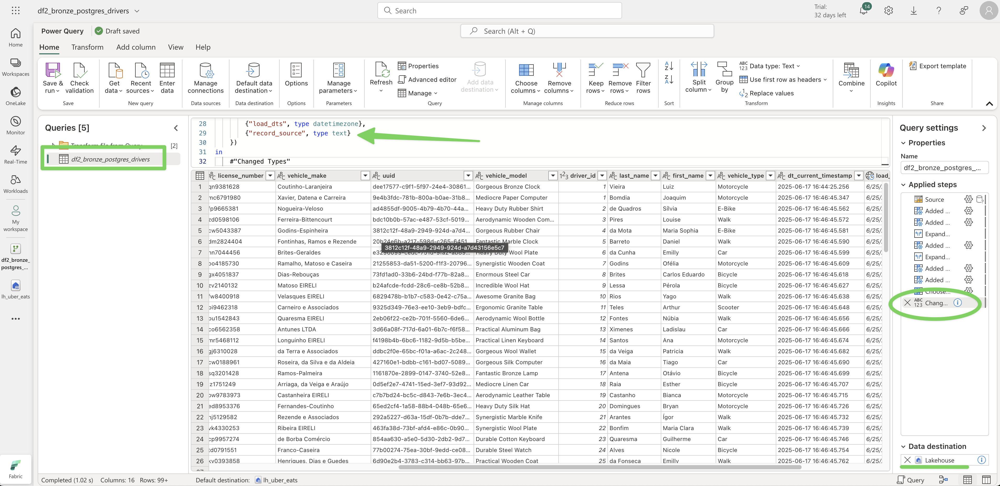
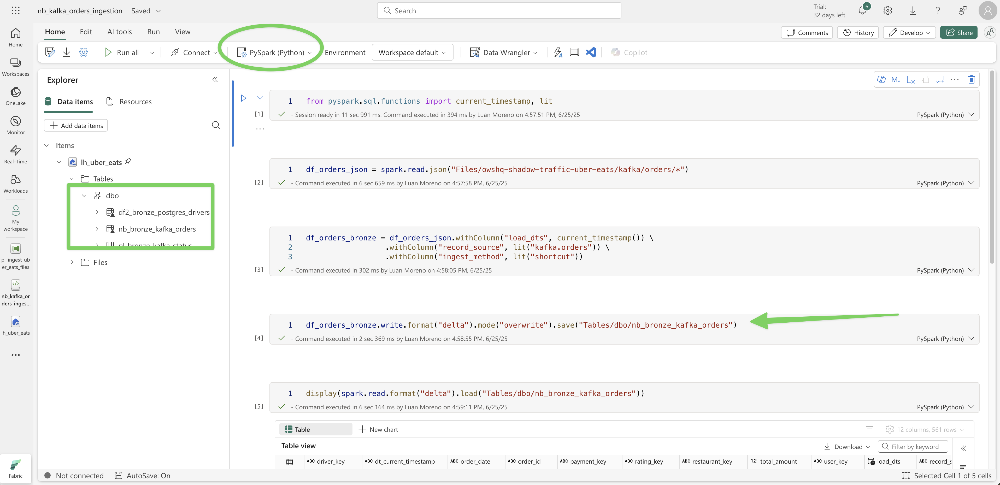
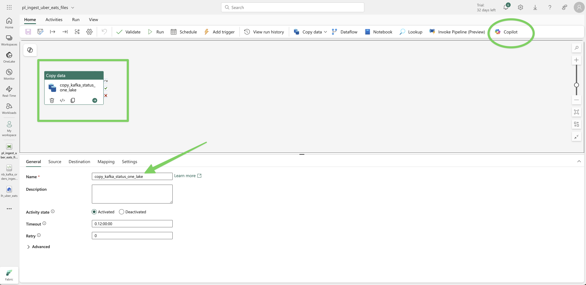

# Microsoft Fabric Data Engineering Workshop

A comprehensive hands-on workshop demonstrating modern data engineering practices using Microsoft Fabric, featuring real-world UberEats data scenarios and medallion architecture implementation.



## 🚀 Overview

This workshop provides practical experience with Microsoft Fabric's unified analytics platform, teaching you to build scalable data pipelines using the medallion architecture pattern. You'll work with realistic UberEats operational data across multiple systems and formats.

### What You'll Learn

- **Microsoft Fabric Fundamentals**: OneLake, Lakehouses, and unified analytics
- **Data Ingestion Patterns**: Multiple approaches using DataFlow Gen2, Shortcuts, and Pipelines
- **Medallion Architecture**: Bronze → Silver → Gold data transformation patterns
- **Data Quality Engineering**: Clean, verify, conform, match, and munge techniques
- **Enterprise Data Practices**: CI/CD, governance, and best practices

## 🏗️ Architecture

### Data Sources Overview
Our workshop simulates a realistic microservices architecture with data distributed across multiple systems:

- **PostgreSQL**: Driver and inventory data
- **MySQL**: Restaurant, product, and rating information  
- **MongoDB**: User profiles, recommendations, and support tickets
- **Apache Kafka**: Real-time event streams (orders, payments, status updates)

### Medallion Data Architecture



## 📚 Workshop Structure

### 🔧 Environment Setup
- [**Environment Initialization**](init-env.md) - Complete Microsoft Fabric setup guide
- Lakehouse creation and configuration
- OneLake fundamentals and best practices

### 📥 Data Ingestion Methods

Learn three different approaches to data ingestion, each with distinct advantages:

#### 1. DataFlow Gen2 - Visual Low-Code Approach


- [**DataFlow Gen2 Implementation**](src/ingest/dataflow-gen-2.md)
- **Use Case**: PostgreSQL drivers data from JSON files
- **Best For**: Business analysts, Power BI developers
- **Features**: Visual interface, Power Query transformations, built-in connectors

#### 2. Shortcut + Notebook - Data Virtualization


- [**Shortcut + Notebook Implementation**](src/ingest/shortcut-notebook.md)
- **Use Case**: Kafka orders data via OneLake shortcuts
- **Best For**: Data engineers, technical developers
- **Features**: Zero data movement, PySpark processing, Git integration

#### 3. Fabric Pipeline - Enterprise Orchestration


- [**Pipeline Implementation**](src/ingest/fabric-pipeline.md)
- **Use Case**: Kafka status data with enterprise workflows
- **Best For**: Production environments, complex orchestration
- **Features**: Visual design, built-in activities, monitoring & alerting

### 🔄 Data Transformation

#### Bronze to Silver Transformation
- [**Comprehensive Notebook Implementation**](src/transform/nb_bronze_silver_uber_eats.ipynb)
- [**Transformation Guide**](src/transform/spark-notebook.md)

**8-Phase Transformation Process:**

1. **Environment Setup** - Load bronze tables and verify availability
2. **Quality Assessment** - Analyze schemas and identify data issues  
3. **Data Cleansing** - Clean and standardize while maintaining granularity
4. **Verification** - Apply business rules and validation flags
5. **Conformance** - Standardize formats and create unified schemas
6. **Enrichment** - Add calculated fields and business logic
7. **Final Preparation** - Optimize schemas for silver layer
8. **Persistence** - Write to Delta Lake with optimization

## 📊 Sample Data Structure

### Business Entities Covered

- **👥 Users** - Customer profiles and demographics
- **🏪 Restaurants** - Establishment details and cuisine types
- **🚗 Drivers** - Delivery partner information and vehicle details
- **📦 Orders** - Transaction records and order lifecycle
- **📱 Status Updates** - Real-time order tracking events
- **💳 Payments** - Financial transaction processing
- **⭐ Reviews** - Customer feedback and ratings

### Data Formats Supported
- **Structured**: SQL databases (PostgreSQL, MySQL)
- **Semi-structured**: JSON, JSONL event streams
- **Unstructured**: Text files, CSV exports
- **Real-time**: Kafka event streams

## 🛠️ Prerequisites

- Microsoft Fabric workspace access
- Contributor or Admin role permissions
- Basic understanding of data engineering concepts
- Familiarity with SQL and Python (helpful but not required)

## 🚀 Getting Started

### Quick Start Guide

1. **Environment Setup**
   ```bash
   # Follow the comprehensive setup guide
   📖 Read: init-env.md
   ```

2. **Create Your Lakehouse**
   - Name: `lh_uber_eats`
   - Enable public schema preview
   - Verify SQL endpoint creation

3. **Choose Your Learning Path**
   
   **🎯 For Business Analysts:**
   - Start with [DataFlow Gen2](src/ingest/dataflow-gen-2.md)
   - Focus on visual, low-code approaches
   
   **🎯 For Data Engineers:**
   - Begin with [Shortcut + Notebook](src/ingest/shortcut-notebook.md)
   - Explore programmatic transformations
   
   **🎯 For Enterprise Architects:**
   - Review [Pipeline Implementation](src/ingest/fabric-pipeline.md)
   - Understand orchestration patterns

4. **Data Transformation**
   ```python
   # Load the comprehensive transformation notebook
   📓 Open: src/transform/nb_bronze_silver_uber_eats.ipynb
   ```

## 📁 Repository Structure

```
workshop-ms-fabric-de/
├── 📋 init-env.md                          # Environment setup guide
├── 📂 images/                              # Workshop diagrams and visuals
│   ├── img-dataflow-gen-2.png
│   ├── img-fabric-pipeline.png
│   └── img-shortcut-notebook.png
├── 📂 src/
│   ├── 📂 ingest/                          # Data ingestion methods
│   │   ├── dataflow-gen-2.md              # Visual low-code approach
│   │   ├── fabric-pipeline.md             # Enterprise orchestration
│   │   └── shortcut-notebook.md           # Data virtualization
│   └── 📂 transform/                       # Data transformation
│       ├── nb_bronze_silver_uber_eats.ipynb   # Complete notebook
│       ├── nb_bronze_silver_uber_eats.py      # Python version
│       └── spark-notebook.md                  # Transformation guide
└── 📂 storage/                             # Sample data files
    ├── kafka_orders.jsonl
    ├── kafka_status.jsonl
    └── postgres_drivers.jsonl
```

## 🎯 Learning Outcomes

By completing this workshop, you will:

### Technical Skills
- ✅ Master Microsoft Fabric core concepts and capabilities
- ✅ Implement medallion architecture for enterprise data lakes
- ✅ Build robust data pipelines with multiple ingestion patterns
- ✅ Apply comprehensive data quality techniques
- ✅ Optimize Delta Lake tables for analytics workloads

### Best Practices
- ✅ Understand when to use different Fabric tools and experiences
- ✅ Implement proper data governance and security patterns
- ✅ Design scalable data architectures
- ✅ Apply enterprise-grade CI/CD practices
- ✅ Monitor and optimize data pipeline performance

### Business Value
- ✅ Reduce time-to-insight for analytics projects
- ✅ Enable self-service analytics for business users
- ✅ Establish governed data foundation for AI/ML initiatives
- ✅ Create reusable patterns for organization-wide adoption

## 🧪 Workshop Labs

### Lab 1: Environment Setup & Fundamentals
**Duration**: 30 minutes  
**Objective**: Set up Microsoft Fabric environment and understand core concepts

- Create Lakehouse with proper configuration
- Understand OneLake architecture and benefits
- Explore Fabric experiences and workspaces
- Configure security and access controls

### Lab 2: Data Ingestion Patterns
**Duration**: 90 minutes  
**Objective**: Master three different data ingestion approaches

#### Lab 2A: DataFlow Gen2 (30 min)
- Visual data preparation with Power Query
- JSON file processing and transformation
- Audit column addition and data validation
- Best practices for business user adoption

#### Lab 2B: Shortcut + Notebook (30 min)  
- OneLake shortcuts for data virtualization
- PySpark programming for data transformation
- Git integration and version control
- Performance optimization techniques

#### Lab 2C: Fabric Pipeline (30 min)
- Enterprise orchestration and scheduling
- Copy activities and data movement
- Monitoring and alerting configuration
- Integration with external systems

### Lab 3: Bronze to Silver Transformation
**Duration**: 120 minutes  
**Objective**: Implement comprehensive data quality transformation

- **Phase 1-2**: Environment setup and quality assessment (20 min)
- **Phase 3-4**: Data cleansing and validation (30 min)
- **Phase 5-6**: Conformance and enrichment (30 min)
- **Phase 7-8**: Final preparation and persistence (40 min)

### Lab 4: Advanced Topics (Optional)
**Duration**: 60 minutes  
**Objective**: Explore advanced Fabric capabilities

- Delta Lake optimization and maintenance
- Data governance and lineage tracking
- Performance tuning and monitoring
- CI/CD pipeline implementation

## 📈 Performance Benchmarks

### Expected Processing Times
| Data Volume | Bronze Ingestion | Silver Transformation | Total Pipeline |
|-------------|------------------|----------------------|----------------|
| 1K records  | < 1 minute      | 2-3 minutes         | < 5 minutes    |
| 10K records | 2-3 minutes     | 5-8 minutes         | < 15 minutes   |
| 100K records| 5-10 minutes    | 15-25 minutes       | < 45 minutes   |

### Resource Optimization
- **Spark Configuration**: High concurrency mode enabled
- **Delta Lake**: V-Order optimization applied
- **Partitioning**: Date-based for time-series data
- **Caching**: Strategic DataFrame caching for iterative operations

## 🔗 Additional Resources

### Microsoft Documentation
- [Microsoft Fabric Documentation](https://docs.microsoft.com/fabric/)
- [OneLake Architecture Guide](https://docs.microsoft.com/fabric/onelake/)
- [Delta Lake Best Practices](https://docs.microsoft.com/fabric/data-engineering/delta-lake-overview)
- [Spark Configuration Guide](https://docs.microsoft.com/fabric/data-engineering/spark-compute-overview)

### Learning Paths
- [Microsoft Learn: Fabric Fundamentals](https://learn.microsoft.com/training/paths/get-started-fabric/)
- [Microsoft Learn: Data Engineering in Fabric](https://learn.microsoft.com/training/paths/data-engineer-fabric/)
- [Microsoft Learn: Data Science in Fabric](https://learn.microsoft.com/training/paths/data-science-fabric/)

### Community & Support
- [Microsoft Fabric Community](https://community.fabric.microsoft.com/)
- [GitHub Issues](https://github.com/luanmorenommaciel/workshop-ms-fabric-de/issues)
- [Workshop Discussions](https://github.com/luanmorenommaciel/workshop-ms-fabric-de/discussions)
- [Stack Overflow - Microsoft Fabric](https://stackoverflow.com/questions/tagged/microsoft-fabric)

## 🤝 Contributing

We welcome contributions to improve this workshop! Please see our contribution guidelines for details on:

- **Reporting Issues**: Use GitHub Issues with detailed descriptions
- **Suggesting Enhancements**: Feature requests and improvements
- **Submitting Pull Requests**: Code contributions and documentation updates
- **Code of Conduct**: Respectful and inclusive community guidelines

### Contribution Areas
- 📝 Documentation improvements and clarifications
- 🐛 Bug fixes and error corrections
- ✨ New lab exercises and advanced scenarios
- 🔧 Performance optimizations and best practices
- 🌐 Translations and internationalization

## ❓ Troubleshooting

### Common Issues

#### Environment Setup
- **Issue**: Lakehouse creation fails
  - **Solution**: Verify workspace permissions and capacity allocation
  - **Reference**: [Fabric Capacity Management](init-env.md#capacity-management)

#### Data Ingestion
- **Issue**: DataFlow Gen2 connection errors
  - **Solution**: Check network connectivity and authentication
  - **Reference**: [DataFlow Gen2 Troubleshooting](src/ingest/dataflow-gen-2.md#troubleshooting)

- **Issue**: Shortcut path not accessible
  - **Solution**: Verify storage permissions and URL correctness
  - **Reference**: [Shortcut Configuration](src/ingest/shortcut-notebook.md#verification)

#### Data Transformation
- **Issue**: Spark session timeouts
  - **Solution**: Optimize code and increase session timeout
  - **Reference**: [Performance Tuning](src/transform/spark-notebook.md#performance-considerations)

- **Issue**: Schema evolution errors
  - **Solution**: Enable schema merge options in Delta Lake writes
  - **Reference**: [Delta Lake Configuration](src/transform/spark-notebook.md#delta-lake-optimization)

## 📊 Workshop Metrics

### Success Criteria
- [ ] Environment successfully configured within 30 minutes
- [ ] All three ingestion patterns completed successfully
- [ ] Bronze to Silver transformation produces clean data
- [ ] Delta Lake tables optimized and performant
- [ ] Understanding of when to use each approach

### Assessment Questions
1. When would you choose DataFlow Gen2 vs Spark Notebooks?
2. How does the medallion architecture improve data quality?
3. What are the benefits of OneLake shortcuts vs data copying?
4. How do you optimize Delta Lake tables for analytics workloads?
5. What governance practices should be implemented in production?

## 📄 License

This project is licensed under the MIT License - see the [LICENSE](LICENSE) file for details.

### Data Attribution
Sample data used in this workshop is synthetically generated for educational purposes. Any resemblance to real operational data is purely coincidental.

## 👨‍💼 About the Author

**Luan Moreno M. Maciel**  
*SME Microsoft Fabric*

- 🏢 **Expertise**: Microsoft Fabric, Azure Data Platform, Data Architecture
- 💼 **Experience**: 10+ years in data engineering and analytics
- 🎓 **Certifications**: Microsoft Certified: Azure Data Engineer Associate
- 📍 **Location**: Brazil

**Connect & Follow:**
- [LinkedIn](https://linkedin.com/in/luanmorenomaciel)
- [GitHub](https://github.com/luanmorenommaciel)
- [Twitter](https://twitter.com/luanmorenomaciel)
- [Blog](https://blog.luanmoreno.com)

### Acknowledgments

Special thanks to the Microsoft Fabric product team and the data engineering community for their continuous innovation and support in making modern data platforms accessible to everyone.

---

**⭐ Star this repository if you found it helpful!**  
**🔄 Share with your team to spread data engineering knowledge**  
**💬 Join our [discussions](https://github.com/luanmorenommaciel/workshop-ms-fabric-de/discussions) for questions and collaboration**

*Last updated: June 2025 | Workshop Version: 2.0*
